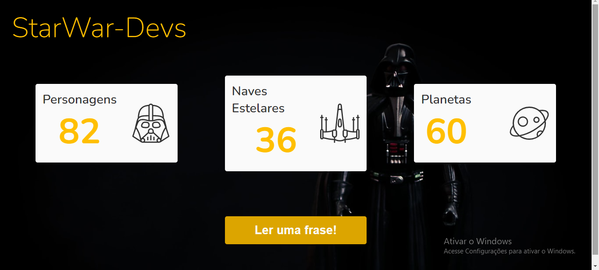

#   Projeto StarWar-Devs

## Descrição:
Projeto, onde iremos consumir duas APIS, que tem como tema principal a franquia do STARWAR.
A primeira API, carregar dados, como a quantidade de personagens, planetas e naves.
A seguda API, trará frases, citações dos filmes, conforme a gente clicar no botão, carrega mais uma frase.

[🔗 Clique aqui para acessar](https://marcos-franco.github.io/StarWar-Devs/)

## 🛠 Tecnologias:
- HTML
- CSS
- Javascript
- Consumo de API
- Git
- Github

## Status do Projeto:
100% Concluído

## Autor:
Projeto desenvolvido por [Marcos Franco](https://www.linkedin.com/in/marcosfranco-5b1a8a111/)

## 💛 Contatos:

Linkedin: https://www.linkedin.com/in/marcosfranco-5b1a8a111/

Repositório Github: https://github.com/marcos-franco

WhatSapp: https://contate.me/marcos-franco

E-mail: masf68@hotmail.com
